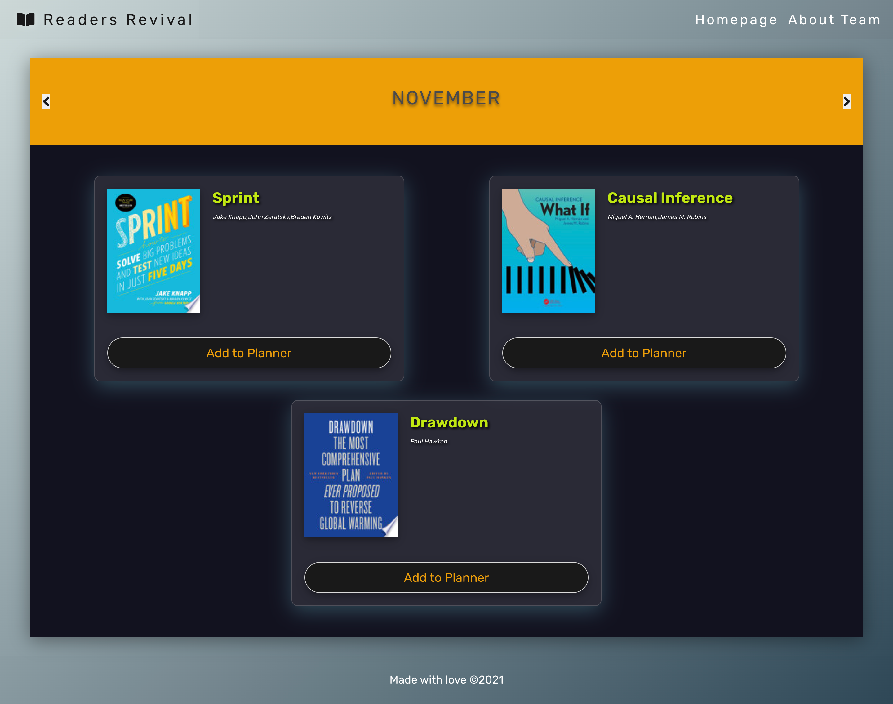
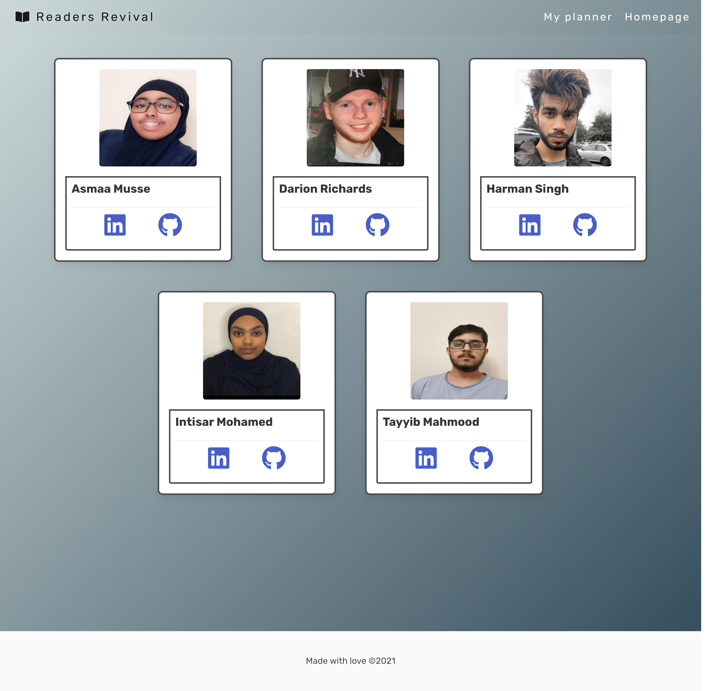
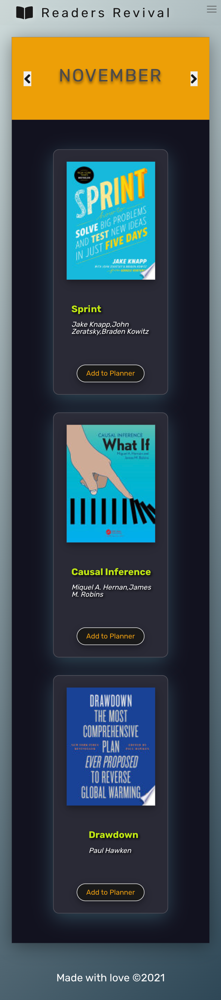
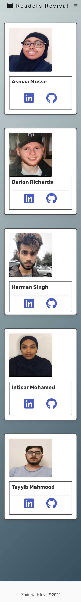
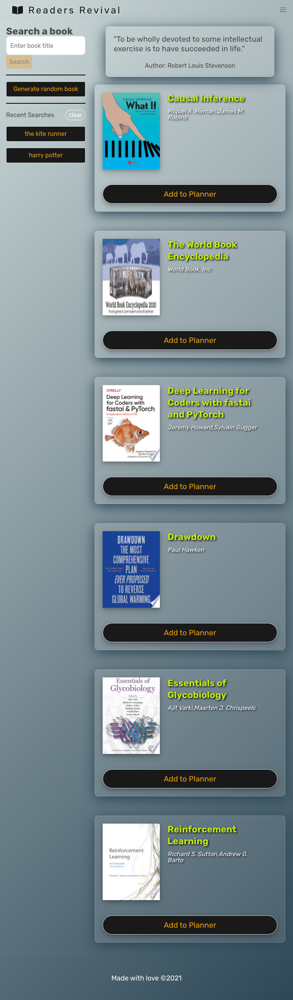

# Readers Revival

## Table of Content

- [Deployed Link](#deployed-link)
- [Contributors](#contributors)
- [About the Project](#about-the-project)
  - [User Flows](#user-flows)
  - [Technologies Used](#technologies-used)
  - [Web APIs](#web-apis)
- [Plans for Improvement](#plans-for-improvement)
- [Screenshots](#screenshots)

## Deployed Link

### Contributors

- Asmaa:https://github.com/AsmaaMusse
- Darion:https://github.com/DarionRichards
- Harman:https://github.com/AkenEagle
- Intisar:https://github.com/intisarmohamed
- Tayyib:https://github.com/Tayyibm21

# About The Project

Reading Revivals is a reading planner application. In the reading planner the user can search for a specific book or get ideas on what to read by clicking on the generate random book button.The user can also add books to their planner and view scheduled books per month in the my planner page. To go with our theme of reading we have incorporated quotes which is displayed in the home page.

### User Flows

When the user goes to the homepage they are able to search for a specific book using the search bar or click on the generate random books button which will display six random books. From the homepage the user can also see their recent searches.

After the user searches or clicks on the generate random book button they are presented with six book cards which hold information about the displayed book.Following the user clicking on the add to planner button they are presented with a calender pop up in which they select the date they would like to read the chosen book.

## Each Book card contains the following:

- Book Thumbnail
- Book Title
- Authors name
- Add to Planner button

### Technologies Used

For this project we used the following technologies:

- HTML
- CSS
- Javascript
- jQuery
- Web APIs
- Moment.js
- Bulma (CSS framework)

### Web APIs

To get the required data we used the following APIs:

- [Google Books API](https://developers.google.com/books/docs/v1/using)
- [Go Quotes API](https://goquotes.docs.apiary.io/#reference)

### Plans for Improvement

- Include a notification feature to say there are no books within a month when viewing the planner

- Include autocomplete for searching of books

- Include more books within a result, when making a search

- Create search feature, that allows users to search for books using ISBN (International Standard Book Number)

- Create search feature, that allows users to search for books using a specific subject

- Create search feature, that allows users to search for books by specific authors

# Screenshots

## Desktop:

#### Home page with recent searches

#### My Planner

#### About Team

## Mobile

#### Home page with recent searches

#### My Planner

#### About Team

## Tablet

